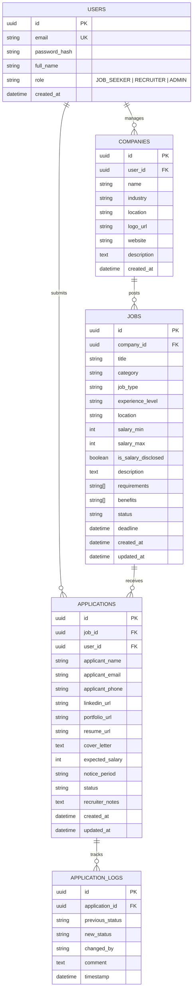

# Product Requirement Document (PRD)

**Project Title**: IndoKerja.id – Job Application & Recruitment Simulation Platform  
**Document Version**: `1.3.0`  
**Status**: `Approved for Implementation`  
**Lead Architect**: Senior Software Engineer (10+ Years Experience)  
**Tech Stack**:

- **Frontend**: React.js + TypeScript
- **Backend**: Node.js (Express.js) + TypeScript
- **Database**: PostgreSQL
- **ORM**: Prisma

---

## 1. Executive Summary & Core Assessment Pillars

### 1.1 Background & Overview

**IndoKerja.id** adalah platform simulasi lowongan dan lamaran kerja komprehensif yang dirancang dengan standar _production-grade fullstack engineering_. Dokumen ini memetakan seluruh spesifikasi sistem dengan fokus utama pada 6 pilar kriteria penilaian:

1. **Authentication & Authorization**: Registrasi, login aman berbasis password hashing (`bcrypt`), manajemen sesi berbasis JWT (JSON Web Token), dan Role-Based Access Control (RBAC) untuk `JOB_SEEKER`, `RECRUITER`, dan `ADMIN`.
2. **API Validation**: Validasi ketat pada setiap payload request (Request Body, Query Params, Path Params) menggunakan skema type-safe (_Zod/Joi_) di tingkat middleware sebelum menyentuh service layer.
3. **Proper Error Handling**: Mekanisme penanganan error terpusat (_Centralized Global Error Handler_), format response error standar (RFC 7807/Envelope), dan mapping error database Prisma (seperti kode `P2002` untuk duplicate entry, `P2025` untuk record not found).
4. **Database Relationship yang Baik**: Desain skema relasional PostgreSQL yang ternormalisasi (1-to-many, 1-to-1) dengan foreign keys, cascading delete/update, unique constraints, dan pengindeksan (_indexes_) untuk performa optimal.
5. **Responsive UI**: Antarmuka React.js modern yang adaptif di berbagai resolusi layar (Mobile, Tablet, Desktop) dengan micro-interactions, skeleton loading, status badge dinamis, dan feedback interaktif.
6. **Clean & Maintainable Code**: Penerapan _Clean / Layered Architecture_ (Controller, Service, Repository, DTO), prinsip SOLID, full TypeScript typing (tanpa `any`), serta dokumentasi kode yang terstruktur.

---

## 2. Tech Stack & Architecture Overview

### 2.1 Core Technologies

- **Frontend**:
  - Framework: React.js (Vite + TypeScript)
  - Styling: Vanilla CSS / TailwindCSS (Desain bersih, modern, dan responsif)
  - State Management: React Context / Custom Hooks
  - UI Helpers: Lucide Icons, Toast Notifications
- **Backend**:
  - Runtime & Framework: Node.js + Express.js + TypeScript
  - Validation: Zod (Type-safe request DTO validation)
  - Security & Auth: `bcrypt` (Password Hashing), `jsonwebtoken` (JWT), `helmet`, `cors`
  - Logging: Morgan & Structured Console Logger
- **Database & Persistence**:
  - **Database**: PostgreSQL
  - **ORM**: Prisma ORM (Type-safe queries, relational migrations, database seeding)

---

## 3. User Roles & RBAC Matrix (Authentication & Authorization)

Sistem mendukung autentikasi mandiri dan simulasi role switcher:

| Modul / Tindakan                           | Guest (Unauthenticated) | Job Seeker (`JOB_SEEKER`) | Recruiter / Employer (`RECRUITER`) |
| :----------------------------------------- | :---------------------: | :-----------------------: | :--------------------------------: |
| Register & Login                           |           ✅            |            ✅             |                 ✅                 |
| Jelajah & Search Lowongan Kerja            |           ✅            |            ✅             |                 ✅                 |
| Lihat Detail Lowongan & Perusahaan         |           ✅            |            ✅             |                 ✅                 |
| Submit Lamaran Kerja (Apply Job)           |           ❌            |     ✅ (Wajib Login)      |                 ❌                 |
| Dashboard Pelacak Status Lamaran Pribadi   |           ❌            |            ✅             |                 ❌                 |
| Buat, Edit, Hapus Lowongan (_Job Posting_) |           ❌            |            ❌             |  ✅ (Kelola Lowongan Perusahaan)   |
| Review Pelamar & Akses ATS Pipeline        |           ❌            |            ❌             |                 ✅                 |
| Update Status Seleksi & Beri Feedback      |           ❌            |            ❌             |                 ✅                 |

---

## 4. Functional Requirements (FR)

### 4.1 Modul Autentikasi & Otorisasi

- **FR-AUTH-01 (User Registration)**: Pendaftaran akun baru dengan validasi format email, password kuat (min. 8 karakter), nama lengkap, dan pemilihan role (`JOB_SEEKER` atau `RECRUITER`).
- **FR-AUTH-02 (User Login & JWT Issuance)**: Autentikasi dengan pencocokan hash bcrypt dan penerbitan JWT payload (`userId`, `email`, `role`).
- **FR-AUTH-03 (Auth Middleware & Guards)**: Middleware `authenticateToken` untuk verifikasi signature JWT dan `authorizeRoles(['RECRUITER'])` untuk proteksi endpoint berbasis hak akses.

### 4.2 Modul Lowongan Kerja (Job Listings & Management)

- **FR-JOB-01 (Search & Filter)**: Pencarian multi-kriteria (kata kunci judul/perusahaan, kategori, tipe pekerjaan: _Full-Time, Remote, Hybrid_, lokasi, rentang gaji) dengan pagination efisien.
- **FR-JOB-02 (Job Details)**: Rincian lengkap pekerjaan, profil perusahaan pembuat lowongan, kualifikasi, benefit, dan tanggal penutupan.
- **FR-JOB-03 (Recruiter Job CRUD)**: Perekrut dapat mempublikasikan lowongan baru, mengubah detail, dan menutup lowongan (_status: CLOSED_).

### 4.3 Modul Lamaran Kerja (Job Application & Tracker)

- **FR-APP-01 (Multi-Field Application Submission)**: Pengisian data lamaran:
  - Data diri pelamar (Nama, Email, No. HP, URL LinkedIn & Portofolio).
  - Resume / CV (Simulasi upload file atau URL resume) & Cover Letter.
  - Ekspektasi Gaji & Notice Period.
- **FR-APP-02 (Duplicate Prevention)**: Proteksi level database (`@@unique([jobId, applicantEmail])`) untuk mencegah kandidat melamar ganda pada lowongan yang sama.
- **FR-APP-03 (Status Tracker Pelamar)**: Dashboard pelamar untuk memantau status secara live:
  - `SUBMITTED` _(Terkirim)_
  - `SCREENING` _(Peninjauan Berkas)_
  - `INTERVIEW` _(Tahap Wawancara)_
  - `OFFERED` _(Penawaran Kerja)_
  - `REJECTED` _(Ditolak)_

### 4.4 Modul ATS Pipeline & Review Kandidat (Recruiter)

- **FR-ATS-01 (Candidate Pipeline)**: Daftar pelamar terorganisir per lowongan dengan filter status.
- **FR-ATS-02 (Status Transition & Feedback Note)**: Perekrut dapat memindahkan status kandidat ke tahapan berikutnya dan menambahkan catatan evaluasi internal (_Recruiter Notes_).
- **FR-ATS-03 (Audit Trail Logging)**: Pencatatan riwayat setiap kali status pelamar diperbarui ke dalam tabel `application_logs`.

---

## 5. Non-Functional Requirements & Engineering Standards

### 5.1 API Validation (Zod Schema Validation)

- Setiap request body, query parameter, dan route parameter divalidasi menggunakan skema Zod sebelum dieksekusi oleh controller.
- Jika data tidak valid, request dihentikan langsung di level middleware dengan mengembalikan HTTP `400 Bad Request` dan pesan error spesifik per field.

### 5.2 Proper & Centralized Error Handling

- **Global Error Handler**: Menangani seluruh uncaught exceptions, custom ApplicationError, Zod ValidationError, dan Prisma Error.
- **Error Mapping Prisma**:
  - `P2002` (Unique constraint failed) ➔ `409 Conflict` (misal: Email sudah terdaftar / Lamaran sudah diajukan).
  - `P2025` (Record not found) ➔ `404 Not Found`.
  - `P2003` (Foreign key constraint violation) ➔ `400 Bad Request`.
- **Response Format Terstandarisasi**:

```json
{
  "success": false,
  "message": "Validation Error",
  "errors": [
    { "field": "applicantEmail", "message": "Invalid email address format" }
  ],
  "timestamp": "2026-08-14T19:35:00Z"
}
```

### 5.3 Responsive UI & UX

- Tampilan adaptif untuk Mobile (<640px), Tablet (640px - 1024px), dan Desktop (>1024px).
- Status badge dengan warna semantik (_Emerald/Green for Offered, Blue for Interview, Amber for Screening, Slate for Submitted, Rose/Red for Rejected_).
- Micro-interactions: Skeleton loading saat data dimuat, feedback toast message saat berhasil melamar / update status, debounce pada input pencarian (300ms).

### 5.4 Clean & Maintainable Code

- **Layered Architecture**:
  - `src/controllers/`: Handle HTTP request/response & status code.
  - `src/services/`: Pure business logic, authorization rules, orchestration.
  - `src/repositories/` / Prisma Client: Data access layer, query isolation.
  - `src/schemas/`: Zod validation schemas.
  - `src/middlewares/`: Auth token verification, RBAC guard, error handler.
- **Strict TypeScript**: `noImplicitAny: true`, strict null checks, type inference dari Prisma Client.

---

## 6. Database Relationship & Prisma Schema Specification



### Prisma Schema (`schema.prisma`)

```prisma
datasource db {
  provider = "postgresql"
  url      = env("DATABASE_URL")
}

generator client {
  provider = "prisma-client-js"
}

enum Role {
  JOB_SEEKER
  RECRUITER
  ADMIN
}

enum JobType {
  FULL_TIME
  PART_TIME
  CONTRACT
  INTERNSHIP
  REMOTE
  HYBRID
}

enum ExperienceLevel {
  ENTRY_LEVEL
  JUNIOR
  MID_LEVEL
  SENIOR
  LEAD
}

enum JobStatus {
  ACTIVE
  CLOSED
  DRAFT
}

enum ApplicationStatus {
  SUBMITTED
  SCREENING
  INTERVIEW
  OFFERED
  REJECTED
}

model User {
  id           String        @id @default(uuid())
  email        String        @unique
  passwordHash String        @map("password_hash")
  fullName     String        @map("full_name")
  role         Role          @default(JOB_SEEKER)
  createdAt    DateTime      @default(now()) @map("created_at")
  updatedAt    DateTime      @updatedAt @map("updated_at")

  companies    Company[]
  applications Application[]

  @@map("users")
}

model Company {
  id          String   @id @default(uuid())
  userId      String?  @map("user_id")
  name        String
  industry    String
  location    String
  logoUrl     String?  @map("logo_url")
  website     String?
  description String?  @db.Text
  createdAt   DateTime @default(now()) @map("created_at")

  user        User?    @relation(fields: [userId], references: [id], onDelete: SetNull)
  jobs        Job[]

  @@map("companies")
}

model Job {
  id                String          @id @default(uuid())
  companyId         String          @map("company_id")
  title             String
  category          String
  jobType           JobType         @default(FULL_TIME) @map("job_type")
  experienceLevel   ExperienceLevel @default(MID_LEVEL) @map("experience_level")
  location          String
  salaryMin         Int?            @map("salary_min")
  salaryMax         Int?            @map("salary_max")
  isSalaryDisclosed Boolean         @default(true) @map("is_salary_disclosed")
  description       String          @db.Text
  requirements      String[]
  benefits          String[]
  status            JobStatus       @default(ACTIVE)
  deadline          DateTime?
  createdAt         DateTime        @default(now()) @map("created_at")
  updatedAt         DateTime        @updatedAt @map("updated_at")

  company           Company         @relation(fields: [companyId], references: [id], onDelete: Cascade)
  applications      Application[]

  @@index([category])
  @@index([location])
  @@index([status])
  @@map("jobs")
}

model Application {
  id             String            @id @default(uuid())
  jobId          String            @map("job_id")
  userId         String?           @map("user_id")
  applicantName  String            @map("applicant_name")
  applicantEmail String            @map("applicant_email")
  applicantPhone String            @map("applicant_phone")
  linkedinUrl    String?           @map("linkedin_url")
  portfolioUrl   String?           @map("portfolio_url")
  resumeUrl      String            @map("resume_url")
  coverLetter    String?           @db.Text @map("cover_letter")
  expectedSalary Int?              @map("expected_salary")
  noticePeriod   String?           @map("notice_period")
  status         ApplicationStatus @default(SUBMITTED)
  recruiterNotes String?           @db.Text @map("recruiter_notes")
  createdAt      DateTime          @default(now()) @map("created_at")
  updatedAt      DateTime          @updatedAt @map("updated_at")

  job            Job               @relation(fields: [jobId], references: [id], onDelete: Cascade)
  user           User?             @relation(fields: [userId], references: [id], onDelete: SetNull)
  logs           ApplicationLog[]

  @@unique([jobId, applicantEmail], name: "unique_job_applicant")
  @@index([applicantEmail])
  @@index([status])
  @@map("applications")
}

model ApplicationLog {
  id             String            @id @default(uuid())
  applicationId  String            @map("application_id")
  previousStatus ApplicationStatus @map("previous_status")
  newStatus      ApplicationStatus @map("new_status")
  changedBy      String            @default("RECRUITER") @map("changed_by")
  comment        String?           @db.Text
  timestamp      DateTime          @default(now())

  application    Application       @relation(fields: [applicationId], references: [id], onDelete: Cascade)

  @@map("application_logs")
}
```

---

## 7. RESTful API Specification

### 7.1 Core Endpoints & Auth Guard Matrix

| Method   | Endpoint                       | Deskripsi                                      | Auth / Role Guard     |
| :------- | :----------------------------- | :--------------------------------------------- | :-------------------- |
| `POST`   | `/api/auth/register`           | Pendaftaran akun baru (Zod validated)          | Public                |
| `POST`   | `/api/auth/login`              | Login user & penerbitan JWT                    | Public                |
| `GET`    | `/api/auth/me`                 | Profil user login aktif                        | Authenticated         |
| `GET`    | `/api/jobs`                    | Katalog lowongan kerja (filter & pagination)   | Public                |
| `GET`    | `/api/jobs/:id`                | Detail lengkap lowongan kerja                  | Public                |
| `POST`   | `/api/jobs`                    | Buat lowongan baru                             | `RECRUITER`, `ADMIN`  |
| `PATCH`  | `/api/jobs/:id`                | Edit lowongan / update status                  | `RECRUITER`, `ADMIN`  |
| `DELETE` | `/api/jobs/:id`                | Hapus lowongan kerja                           | `RECRUITER`, `ADMIN`  |
| `POST`   | `/api/applications`            | Mengirimkan berkas lamaran kerja               | `JOB_SEEKER` / Public |
| `GET`    | `/api/applications`            | List pelamar (ATS Recruiter / Tracker Pelamar) | Authenticated         |
| `GET`    | `/api/applications/:id`        | Detail data pelamar & audit status history     | Authenticated         |
| `PATCH`  | `/api/applications/:id/status` | Update tahapan seleksi & catatan evaluasi      | `RECRUITER`, `ADMIN`  |
| `GET`    | `/api/companies`               | List perusahaan terdaftar                      | Public                |
| `POST`   | `/api/seed`                    | Seed database awal dengan data realistis       | Public / Dev Mode     |

---

## 8. Assessment Implementation Checklist

- [x] **Authentication & Authorization**: JWT token auth, bcrypt password hashing, RBAC guards.
- [x] **API Validation**: Zod schema middleware for all inputs, returning informative HTTP 400.
- [x] **Proper Error Handling**: Centralized error middleware, Prisma error codes mapping, unified response envelope.
- [x] **Good Database Relationship**: Relational PostgreSQL with Prisma ORM, foreign keys, cascading constraints, unique indexes.
- [x] **Responsive UI**: Mobile/Desktop adaptive layouts, status badges, dynamic stepper & toast alerts.
- [x] **Clean & Maintainable Code**: Modular layered architecture (Controller-Service-Repository-Schema), strict TypeScript.
